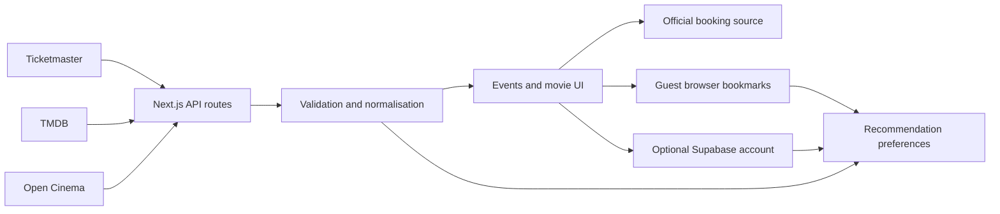

<div align="center">
  
</div>

# KiwiCue


KiwiCue is a bilingual Auckland event and movie discovery platform. It brings concerts, theatre, markets, festivals, community events and cinema information into one place, organised around what is happening soon enough to make a plan.

**Live site:** [kiwicue.vercel.app](https://kiwicue.vercel.app/)

## Features

- Browse Auckland concerts, theatre, markets, festivals, sports and community events through descriptive category cards
- Search by event name or venue
- Filter by category and time window: next 7 days, this weekend, next 30 days or all upcoming
- Open a transparent recommendations page with start-here, weekend and try-something-different picks
- View event details, venue maps and official source links
- Find verified Auckland cinema sessions and recent movie releases
- Keep live screening data separate from movie-release previews
- Sort cinemas by distance using optional browser geolocation
- Save events locally as a guest; opt into an account for cross-device syncing, collections and social features
- Mark activities as Interested, Going or Went, and discuss them with one-level replies
- Choose interests for explainable, deterministic For You recommendations
- Switch between English and Simplified Chinese
- Use the site across desktop and mobile layouts

## Motivation

Auckland event information is spread across ticketing websites, cinema pages, organiser listings and community channels. Finding something to do often means repeating the same search across several sources and checking whether the information is still current.

KiwiCue is designed to reduce that friction:

1. **Useful dates first** — upcoming plans are shown while there is still time to organise and book.
2. **One Auckland view** — different event categories and movie information share one consistent interface.
3. **Clear source links** — final details and booking remain with the official provider.
4. **Honest data states** — verified sessions, release previews, empty results and unavailable sources are clearly distinguished.
5. **Privacy by default** — guest bookmarks and optional location data remain in the browser. Account data is private unless sharing is explicitly enabled.

## Data Sources

| Source | Purpose |
| --- | --- |
| [Ticketmaster Discovery API](https://developer.ticketmaster.com/products-and-docs/apis/discovery-api/v2/) | Auckland event listings and official ticket links |
| KiwiCue verified schedules | Curated local market and community-event information |
| [The Movie Database (TMDB)](https://www.themoviedb.org/) | Movie metadata, posters, ratings and trailers |
| [Open Cinema Project](https://opencinemaproject.com/) | Auckland cinema screening information |

Availability and final event details remain with the relevant organiser, ticketing platform or cinema.

## Implementation Details

KiwiCue uses the Next.js App Router. External data is requested through server-side route handlers, validated and normalised before it reaches the interface. API credentials are never exposed to client components.



### Main Routes

| Route | Description |
| --- | --- |
| `/` | Bilingual landing page and featured Auckland events |
| `/events` | Event search, category filters and time-window browsing |
| `/events/[eventId]` | Event details, venue information and official links |
| `/recommendations` | Explainable event picks using timing, detail quality and browser-local saved preferences |
| `/movies` | Live sessions, movie previews and Auckland cinema directory |
| `/movies/[movieId]` | Movie details, ratings, metadata and trailers |
| `/saved` | Guest browser saves or private, account-synced saves |
| `/for-you` | Explainable recommendations from real events and chosen interests |
| `/collections` | Private-by-default event collections |
| `/account` | Profile, interests, privacy, notification and deletion settings |
| `/notifications` | Private in-app updates |
| `/u/[username]` | Opt-in public profile and collections |

### Tech Stack

- Next.js 16 App Router
- React 19
- TypeScript 5
- Inter Variable and modular CSS
- Vitest, Testing Library and jsdom
- Playwright end-to-end testing
- Vercel deployment
- Optional Supabase Auth, PostgreSQL and RLS for account features

## Development

### Prerequisites

- Node.js 20 or later
- npm
- Ticketmaster Consumer Key
- TMDB API Read Access Token
- Open Cinema API key (free; optional for local fallback, required for the production quota)

### Setup

```bash
git clone https://github.com/hannnnnnnny/kiwicue.git
cd kiwicue
npm install
cp .env.example .env.local
```

Add the event/movie server-side credentials to `.env.local`:

```env
TICKETMASTER_API_KEY=your_ticketmaster_consumer_key
TMDB_READ_ACCESS_TOKEN=your_tmdb_read_access_token
OPEN_CINEMA_API_KEY=your_open_cinema_api_key
```

Start the development server:

```bash
npm run dev
```

Open [http://localhost:3000](http://localhost:3000).

> [!IMPORTANT]
> Never prefix these credentials with `NEXT_PUBLIC_`, commit `.env.local`, include secret values in command arguments, or expose them in logs.

### Optional accounts and social features

Anonymous discovery and local Saved work without Supabase. To enable accounts, create a Supabase project and apply every file in `supabase/migrations/` in filename order. Set these variables locally and in Vercel:

```env
NEXT_PUBLIC_SUPABASE_URL=https://your-project.supabase.co
NEXT_PUBLIC_SUPABASE_PUBLISHABLE_KEY=your_publishable_key
SUPABASE_SERVICE_ROLE_KEY=your_server_only_service_role_key
```

The URL and publishable key are intended for browser clients. The service-role key is used only by the account-deletion route and must never have a `NEXT_PUBLIC_` prefix. Configure Supabase Auth Site URL and redirect allowlist for your local origin and production `/auth/callback` URL. Email/password sign-up, recovery and account deletion require working Auth email delivery and correctly applied migrations. Do not enable account UI in production before RLS policies and deletion have been checked with two separate test users.

Profiles, saved events, interests, comments and notifications are stored in Supabase for signed-in users. Guest bookmarks remain browser-local and are merged on login only after server confirmation. Profiles and collections start private. Behavioural activity is off by default and can be enabled in Account settings; turning it off deletes existing activity records. Search text, credentials and precise browser location are not stored in that activity table.

The checked-in tests validate component and request logic, but they do not replace a live Supabase signup → login → sync → RLS → deletion test. No Supabase credentials are included in this repository.

## Testing

Run the unit, component and integration tests:

```bash
npm test
```

Run the end-to-end test suite:

```bash
npm run test:e2e
```

Additional checks:

```bash
npm run lint
npm run build
```

## Project Structure

```text
kiwicue/
├── app/                 # App Router pages and server API routes
├── components/          # Shared UI and interactive components
├── lib/                 # API clients, validation and domain logic
├── public/brand/        # KiwiCue logo assets
├── tests/               # Unit, component and integration tests
├── e2e/                 # Playwright scenarios
└── docs/plans/          # Design and implementation plans
```

## Deployment

KiwiCue is deployed from this repository to Vercel. Configure `TICKETMASTER_API_KEY`, `TMDB_READ_ACCESS_TOKEN`, and `OPEN_CINEMA_API_KEY` as Sensitive production environment variables before deploying. If enabling accounts, also configure the Supabase variables above and apply migrations first.

```bash
vercel link --yes --project kiwicue
vercel deploy --prod --yes
```

## Licence

No open-source licence has been added to this repository. All rights are reserved unless a licence is added later.

---

Designed and developed by [Harry Han](https://github.com/hannnnnnnny).
